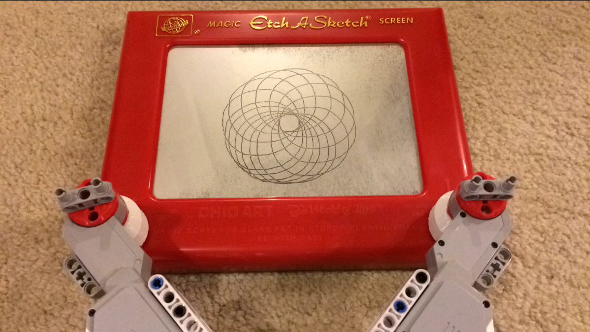

# SketchBot

This is a robot of sorts to drive an Etch-a-sketch. With it you can plot arbitrary single-line paths. A _Turtle Graphics_ implimentation is provided for children to learn programming and robotics. A voronoi stippling tool is provides which, along with a Traveling Salesman solver, [can convert photographs to single-lines suitable for plotting](http://www.cgl.uwaterloo.ca/~csk/projects/tsp/).

## Setup

### Frontend

There are two main components: A front-end, currently provided by [Berkeley's _Snap_](http://snap.berkeley.edu) programming environment for kids. Various project files are included within `frontend/` which customize the extreemely flexible _Snap_ environment to serve as a simulator and language sharpened for working with _SketchBot_.

### Backend

In order to communicate with the hardware from _Snap_, `backend.exe` must be running. This listens for commands over HTTP. It is a .NET console app (written in F#). It depends on the [MonoBrick](www.monobrick.dk) communications library which is included in `external/`.

On Linux or OS X, you will need to install [Mono](http://www.mono-project.com/) and [F#](http://fsharp.org) and may then build with `xbuild` or Xamarin. On Windows, regular .NET will do and you may build from Visual Studio or Xamarin.

    sudo apt-get install mono-complete
    sudo apt-get install fsharp

    xbuild backend.sln

You will need to run backend.exe as an admin (allowed to listen on HTTP). You will be first asked to calibrate the system to learn the extent of the screen on your particular Etch A Sketch. **This is very important:** the motors may easily break things if the knobs are driven off the screen.

## Docs

* [The Pitch](docs/pitch.md)
* [Getting Started](docs/getting_started.md)
* [Intermediate Turtle Graphics](docs/intermediate.md)
* [Roomba](docs/roomba.md)
* [Sketching Photos](docs/stipple.md)
* [Quotes](docs/quotes.md)
