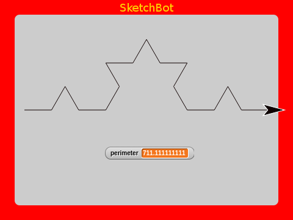
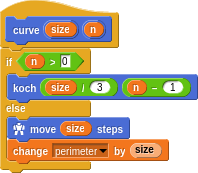
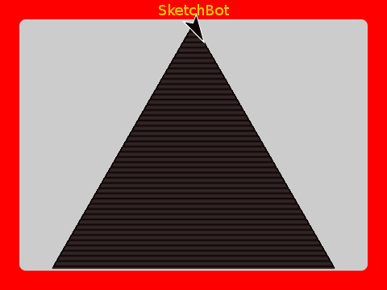
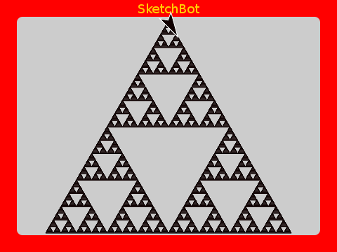

# Fun with Fractals

Once we've learned about [recursion](recursion.md), fractals are a beautiful way to play. A fractal is just a pattern that is "self similar" when we look at it from different "zoom levels".

## Koch Curve

Starting with a straight line:

If we divide it into thirds and make a triangle bend in it like this:

We've increased it's length by a third (look at the `perimiter` value). If we take each of the line segments now and do the same, we start to make an interesting pattern:

Again, we've increased the length by a third (because we've increased each segment by this).

This is a fractal called a Koch Curve. Notice that it is self-similar to the previous instance; by being made of four of them. Continue doing this an we get an increasingly intricate pattern; each a third longer than the last.

The very interesting thing to notice is that as we continue, the length continues to grow by 4/3, but it continues to fit on the Etch A Sketch screen. You can imagine repeating this an _infinite_ number of times and we would theoretically get an _infinitely_ long curve!

It can't be seen on the screen, but here is ten iterations. See that the `perimiter` has grown to more than 7101!

How do we draw such a complicated beast? Well, the self-similarity is begging for [recursion](recursion.md) to be used.

In this case, we're using _mutual_ recursion. The `curve` is defined in terms of `koch`, which is itself defined in terms of `curve` again. Notice though, that `n` is decreased with each iteration and that when it's ≤ 0 then the curve is a simple line like we started with.

The `perimeter` variable is set to 0 initially and tracks the distance traversed; the sum of all the line segments of length `size`.

## [Koch Snowflake](http://en.wikipedia.org/wiki/Koch_snowflake)

A well known fractal using the Koch Curve is the Koch Snowflake. It's just an equalateral triangle with Koch Curves for sides. Very cool!

This is interesting for the same reason as the Curve. As the number of iterations increases (possibly to _infinity_), the perimeter increases, but the area of this closed shape remains finite. A shape with a finite area, but an infinite perimeter. Very strange indeed!

This is a very important concept in mathematics. Knowing that the area grows by less and less with each iteration tells us that it _converges_ at some finite value, while the perimeter grows at a constant rate and so never converges. This concept of knowing the _limits_ of a process is an important one in calculus and a small bit of intuition gained from this example might prove useful later!

## [Hilbert Curve](http://en.wikipedia.org/wiki/Hilbert_curve)

The Hilbert Curve too is a fractal with self-similarity. It is what is known as a _space filling_ curve. Here's how it goes. 

As the number of iterations increases, it fills the area. With lines as thick as an Etch A Sketch, it seems to fill completely within 10 iterations or so.

A subtile point though is that, given any line thickness (except zero; in which case the lines wouldn't exist!), it will eventually fill an area after some number of iterations. It's another lesson in _limits_.

[Side note: This is a fun one to run on the robot and see it clear the whole screen!]

It too is defined rather simply, but [recursively](recursive.md).

## [Sierpinski Triangle](http://en.wikipedia.org/wiki/Sierpinski_triangle)

The Sierpinski Triangle is something like the _opposite_ to the Hilbert Curve. Rather than _fill_ space, it's area is _reduced_ with each iteration until it disappears!

If we could draw with infinitesimally thin lines, then we could watch it reduce to nothing.

The program is similarly defined with a pair of mutually recursive `sierpinski` and `iteration` words.

A filled triangle is just a bunch of triangles within triangles, by the way:

## [Dragon Curve](http://en.wikipedia.org/wiki/Dragon_curve)

As a finale, here is a very beautiful one. Both the code and the result are quite interesting.

Using [higher order functions](hof.md) makes the implementation very concise. It's actually astounding the intricate beauty that can be defined with so little code.

Have fun!
