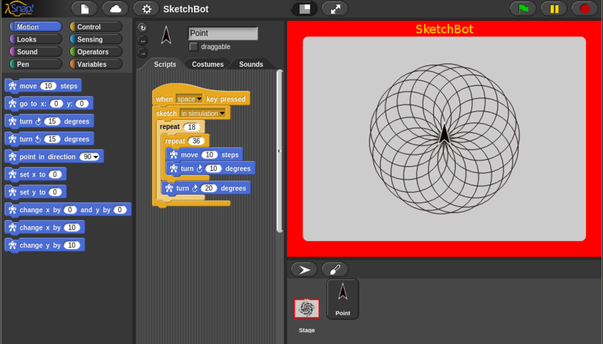
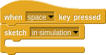
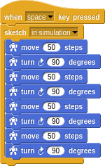
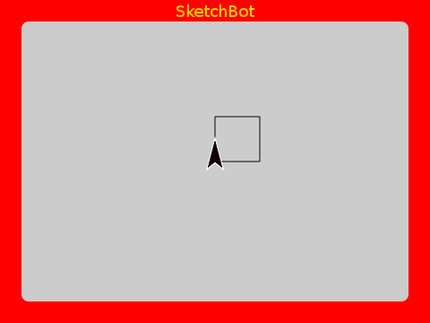
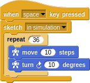
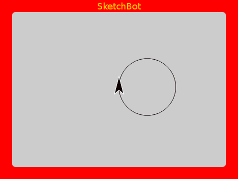
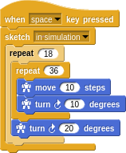
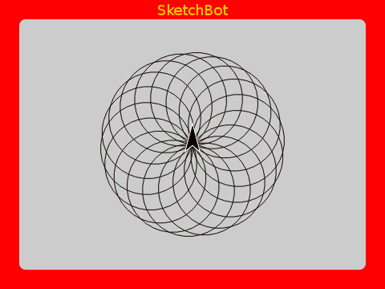

# Getting Started

Let's make sure everything is set up and make our first piece of art.

## SketchBot Snap Integration

Snap is an amazingly flexible programming environment. It is friendly enough for children who can't even read this guide, and it is powerful enough to teach advanced concepts to adults.

> In the glory days of the MIT Logo Lab, we used to say, “Logo is Lisp disguised as BASIC.” Now, with its first class procedures, lexical scope, and first class continuations, Snap! is Scheme disguised as Scratch.

We have customized and sharpened it to make art on the SketchBot.

There is nothing to install to use Snap. Simply visit http://snap.berkeley.edu/run. Next, import the SketchBot environment (`frontend/sketchbot.xml`). As a teacher, you may want to save this project to the Snap cloud for students to access.

## Hello World

Sketch programs are placed within a `sketch` block:

You can imagine that you are driving a little _turtle_ around the screen. Represented by the little black arrow, the turtle has a position and orientation (a _pose_). You can command the turtle to `move` and `turn`. Each command is relative to the current pose. This _Turtle Graphics_ system makes it very easy to define many interesting patterns.

Let's try drawing a square:

Nice!

There is a lot of repeditive code in there. In keeping with the _don't repeat yourself (DRY)_ principle, let's clean that up:

Drawing a square is easy. Have you ever tried to draw a perfect circle on an Etch A Sketch? Not easy for a human, but to a robot it's no more difficult than a straight line.

A circle can be easily approximated by a polygon with many sides; here with 36 sides, 10 steps and 10 degrees appart:

Try adding many circles, each offset by 20 degrees:

Fun!

Notice that the `sketch` block has a dropdown menu from which you may select `on real Etch A Sketch`. Anything you can do in simulation, you can send to SketchBot to be drawn!

But first...

## Calibration

