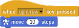
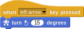
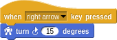
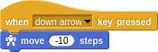
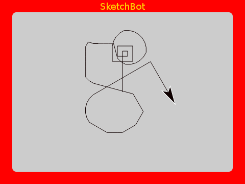
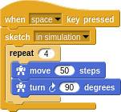
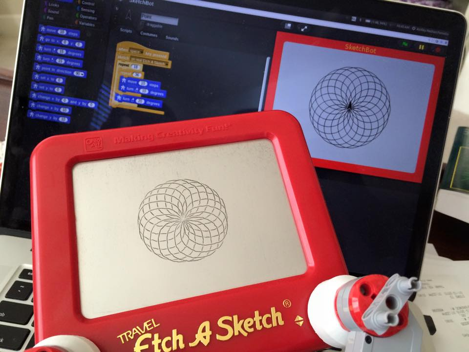

# Getting Started

Let's make sure everything is set up and make our first piece of art.

## SketchBot Snap Integration

Snap is an amazingly flexible programming environment. It is friendly enough for children who can't even read this guide, and it is powerful enough to teach advanced concepts to adults.

> In the glory days of the MIT Logo Lab, we used to say, “Logo is Lisp disguised as BASIC.” Now, with its first class procedures, lexical scope, and first class continuations, Snap! is Scheme disguised as Scratch.

We have customized and sharpened it to make art on the SketchBot.


There is nothing to install to use Snap. Simply visit http://snap.berkeley.edu/run. Next, import the SketchBot environment (`frontend/sketchbot.xml`). As a teacher, you may want to save this project to the Snap cloud for students to access.

## Hello World

Load the `hello` project (`frontend/hello.xml`). With this you can draw using the arrow keys. It is a very simple set of _event handlers_ (which we'll learn more about later) to move about the screen.






You can imagine that you are driving a little _turtle_ around the screen. Represented by the little black arrow, the turtle has a position and orientation (a _pose_). You can command the turtle to `move` and `turn`. Each command is relative to the current pose.



It's kind of fun to manually drive around the screen, but it's a bit tedious. We can **automate** this! This _Turtle Graphics_ system makes it very easy to define many interesting patterns.

Proper Sketch programs are normally placed within a `sketch` block:


Let's try drawing a square:


Nice!

There is a lot of repeditive code there. In keeping with the _don't repeat yourself (DRY)_ principle, let's clean that up with a `repeat` block:



Drawing a square is too easy. Have you ever tried to draw a perfect circle on an Etch A Sketch? Not easy for a human, but for a robot it's no more difficult than a straight vertical/horizontal line.

A circle can be easily approximated by a polygon with many sides; here with 36 sides, 10 steps and 10 degrees appart:


Try adding many circles, each offset by 20 degrees by nesting within another `repeat`:


Fun!

Notice that the `sketch` block has a dropdown menu saying `in simulation`. You may also choose `on real Etch A Sketch`; drawing anything you can do in simulation to with the SketchBot!



## Connecting to SketchBot

Maybe your teacher has already done this, in which case all you need to do is enter the IP addess of the _server_ (just like IP addresses of Minecraft servers). Press 'A' (address) to enter this:


Students may have their own SketchBots, may pair up to collaborate or may all connect to the teacher's.

### Calibration

Run the backend as an adminstrator (`sudo ./backend.exe`):


```text
Welcome to
 ____  _        _       _     ____        _   
/ ___|| | _____| |_ ___| |__ | __ )  ___ | |_ 
\___ \| |/ / _ \ __/ __| '_ \|  _ \ / _ \| __|
 ___) |   <  __/ || (__| | | | |_) | (_) | |_ 
|____/|_|\_\___|\__\___|_| |_|____/ \___/ \__| 1.0

Let's calibrate the Etch A Sketch!
First manually move it to the top left corner.
Then attach the robot and press right/down arrows until *just* reaching the bottom right corner.
Press ENTER when complete.
```

Like it says, we need to do some measuring of the extent of the Etch A Sketch screen. This is **very** important because the SketchBot can quite easily break things if driven off the edge! Once calibrated properly, the system will protect itself from errant student's programs.

Once running, it just listens for commands from student's Snap projects. Many things may be "printed" without having to restart the backend or redo calibration, etc. Just leave it running...

# [Next: Intermediate Turtle Graphics](intermediate.md)
