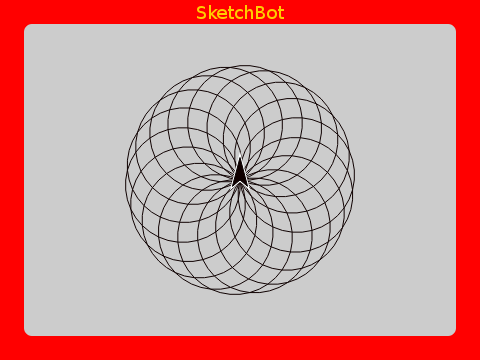

# Higher Order Functions

What do these sketches have in common?

Each is essentially "spinning" some sub-sketch a number of times. Remember the _don't repeat yourself (DRY)_ principle? How can we factor out the commonalities here?

Certainly, we can make a word to spin something a parameterized number of increments.

The question is, what to put in place of the `something`? It's quite common to have this kind of "hole in the middle" of some otherwise general code. You don't want to hard code the specific "filling".

Here the `something` is a "lambda" (notice the little Greek λ), which is itself an unevaluated function we can run at will. Perfect!

In any good language, there should be nothing that cannot be treated "first class". That is, everything should be able to be passed around as data. In some languages, functions can only be parameterized by numbers or other "data". But in good ones, code _is_ data. 

> Side note: Some languages do allow first class functions but then miss other essentials like first class events (I'm looking at _you_ C#!)

Words that take functions as input have the familiar C-shape. Whatever you place within (even multy-block complicated procedures) is passed as an unevaluated function.

Hopefully this seems like a simple and obvious concept. If not then perhaps you've been "mentally mutilated" by exposure to less powerful languages! Dijkstra was likely talking mainly about `goto` but still...

> "It is practically impossible to teach good programming to students that have had a prior exposure to BASIC: as potential programmers they are mentally mutilated beyond hope of regeneration." - Edsger Dijkstra

Consider yourself lucky and have fun sketching!
