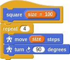
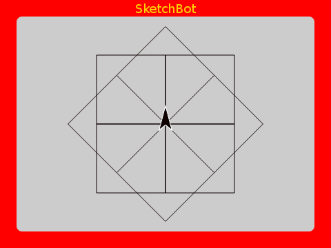
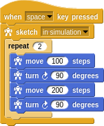
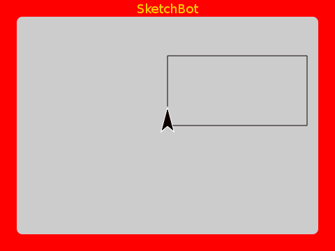
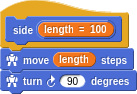
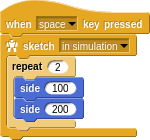
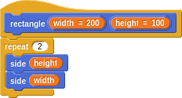
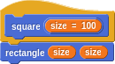

# Intermediate Turtle Graphics

## Abstraction

One of the most important things in programming within any language is the ability to _abstract_. That is, the ability to create new compound constructs that are indistinguishable from the primitives. In this way you can extend the language; defining increasingly compounded things.

In our Turtle Graphics language here, we have primitives such as `move`, `turn`, `repeat`, ... Let's make a `square` definition from what we created earlier.

We've even parameterized our new word with a size. This way we can _reach in_ and poke values into the defintion without cracking it open. More importantly, without having to know how it works at all. This is how you manage complexity as you make more and more intricate things. We can now use our `square` within a familiar pattern.

### Refactoring

The way it normally goes is that you start out playing around. Maybe to make a rectangle you think of this:

Then you notice that each side is the same two steps but with different _parameters_. Once you become sensitive to it, the _don't repeat yourself (DRY)_ principle will make you feel uneasy about even something small like this. So you factor into a new word.

And then reduce the sketch to:

Hey, you may as well name this `rectangle` sketch and parameterize it by the `width` and `height`.

And, oh wait, we can redefine `square` to be simply a rectangle with equal sides!

This idea of making rough sketches (so to speak) and then continually refactoring as you add abstractionr and discover more succinct ways of describing what you want is one of the great joys of programming.
