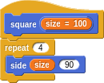
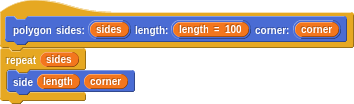
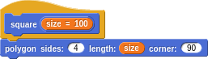
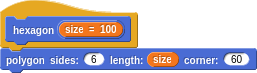
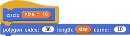
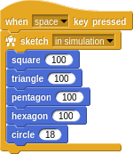
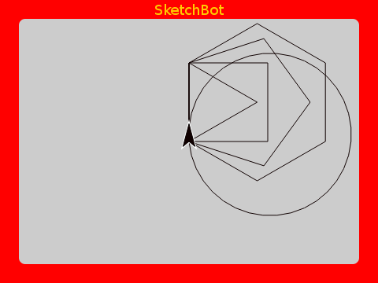

# Intermediate Turtle Graphics

## Abstraction

One of the most important things in programming within any language is the ability to _abstract_. That is, the ability to create new compound constructs that are indistinguishable from the primitives. In this way you can extend the language; defining increasingly compounded things.

In our Turtle Graphics language here, we have primitives such as `move`, `turn`, `repeat`, ... Let's make a `square` definition from what we created earlier.

We've even parameterized our new word with a size. This way we can _reach in_ and poke values into the defintion without cracking it open. More importantly, without having to know how it works at all. This is how you manage complexity as you make more and more intricate things. We can now use our `square` within a familiar pattern.

## Refactoring

The way it normally goes is that you start out playing around. Maybe to make a rectangle you think of this:

Then you notice that each side is the same two steps but with different _parameters_. Once you become sensitive to it, the _don't repeat yourself (DRY)_ principle will make you feel uneasy about even something small like this. So you factor into a new word.

And then reduce the sketch to:

Hey, you may as well name this `rectangle` sketch and parameterize it by the `width` and `height`.

And, oh wait, we can now redefine `square` to be simply a `rectangle` with equal sides!

The pretty pattern we made with squares still works with this new definition of `square`. This is an important point. Any sketch using the definition shouldn't know or care how it works.

This idea of making rough sketches (so to speak) and then continually refactoring as you add abstractions and discover more succinct ways of describing what you want is one of the great joys of programming.

## Generality

Let's play with some other shapes. We should be able to make a triangle the same way we made a square, but with fewer sides and tighter turns.

Oops! I was thinking that the interior angles of an isosceles triangle is 60 degrees. Actually the turn angles in turtle geometry are the _exterior_ angles. We got lucky with the square, where both are 90 degrees. Trying again:

And of course, we should bundle this up and give it a name.

Does anything bother you yet about the definitions we've made so far? How is `triangle` different from `rectangle` or `square`? Why can't we use our `side` definition here?

At the time, we were thinking only about shapes with right-angled corners and so we assumed that `side` with 90 degrees. It's more succinct to make our base definitions as general as possible and then, perhaps, define more specific and specialized things in terms of them.

We can then either go into the `rectangle` definition and hardcode 90, or we could define a new `right angle side` and define `rectangle` in terms of this. We'll leave that up to you.

At any rate, we can now make `triangle` more succinct:

## More Generalization

Defining `square` in terms of `rectangle` couldn't really get more concise, but if we go back and rethink things a bit, we might notice that we could have defined it very similarly to `triangle`:

Rethinking what you've done and sealed away from time to time is a healty habit. Do you see any generalization we can make here?

Both are really just polygons!

The difference is in the number of sides and the corner angles. A square is a _regular quadrilateral_.

Why not go ahead and define a `pentagon`, `hexagon`, ... even a `circle` can be approximated as we did earlier as a many sided polygon.

