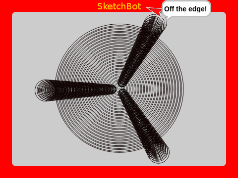

# All About φ and Fibonacci

[Fibonacci](http://en.wikipedia.org/wiki/Fibonacci_number) numbers and [φ](http://en.wikipedia.org/wiki/Golden_ratio) show up again and again in Nature. If you like playing around with numbers (yes, you can **play** with them) then these are some of the most fun.

If you don't believe me, check out this [Vi Hart video on Spirals, Fibonacci and being a plant](https://www.khanacademy.org/math/recreational-math/vi-hart/spirals-fibonacci/v/doodling-in-math-class-spirals-fibonacci-and-being-a-plant-2-of-3).

## Fibonacci

Fibonacci is a sequence of values produced, each the sum of the previous two; starting with 1 and 1.

    1 + 1 = 2
        1 + 2 = 3
            2 + 3 = 5
                3 + 5 = 8
                    5 + 8 = 13
                        8 + 13 = 21
                            13 + 21 = 34
                                 21 = 34 = 55
                                      34 + 55 = 89
                                           55 + 89 = 144
                                                ...
The sequence 1, 1, 2, 3, 5, 8, 13, 21, 34, 55, 89, 144, ... comes out.

This sequence has all kinds of interesting properties, but one is this: if you make fractions out of adjacent pairs, dividing each by its predecessor, you get:

    1/1    = 1
    2/1    = 2
    3/2    = 1.5
    5/3    = 1.666666666...
    8/5    = 1.6
    13/8   = 1.625
    21/13  = 1.615384615...
    34/21  = 1.619047619...
    55/34  = 1.617647059...
    89/55  = 1.618181818...
    144/89 = 1.617977528...
    ...    = 1.618033989...

Going along, we see that it approaches 1.618033989... This is a very special number! It's called  "[Golden ratio](http://en.wikipedia.org/wiki/Golden_ratio)". It's also been called "the most irrational number". It has many fractal-like self similarities. For example 1 + 1/φ = φ or φ + 1 = φ^2.

# φ

The values `a` and `b` are in the golden ratio if (a + b)/a = a/b. When this is true, a/b = φ.

There are other ways to calculate it (e.g. φ = (1 + sqrt 5) / 2), but the ratios of adjacent Fibonacci numbers is a pretty fun one. Here's a sketch to do it:

This makes nice use of [recursion](recursion.md). Given a pair of numbers from the sequence, it calculates and graphs the ratio as the best values of φ so far, then moves along using the `b` as the new `a` and the sum of the two as the new `b`. We go on doing this `forever` (but it'll stop when the graph goes off the screen).

You can see visually that it very quickly converges to φ. Pretty neat!

# Golden Rectangles

Let's take a break to play with an interesting fractal of squares.

Drawing squares beside squares, each smaller than the last by some factor. Let's make each _half_ the size of the previous:

It makes a nice little spiral of squares. How about making each 2/3rds the previous:

Humm... this time the spiral _grows_.

What value can we use that will be in perfect balance; filling all the space without overlapping? If you think about it, what we want is a rectangle from which we can subtract a square and get a rectangle _in the same proportions_.

Hey, didn't we say earlier that 1 + 1/φ = φ? That's what we want! If a rectangle is 1 by φ and we subtract and 1 by 1 square from it, that leave a 1 by (φ - 1) rectangle and 1 / (φ - 1) = φ! Okay, _that's_ cool!

Let's plug in the φ variable we calculated earlier using Fibonacci ratios:

Fits _perfectly_!

## Nautilus

If we put arcs inside each square...

We get the same spiral as is found in a Nautilus shell. How does Nature know about φ?

## Growth Patterns

As you saw if you watched the [Vi Hart video](https://www.khanacademy.org/math/recreational-math/vi-hart/spirals-fibonacci/v/doodling-in-math-class-spirals-fibonacci-and-being-a-plant-2-of-3) earlier, if we look at other growth patterns in Nature we find φ and Fibonacci all over the place.

Let's experiment with optimal packing of seeds (here in a sunflower and a pine cone). Like with the square fractal, Nature wants to find a way to pack the seeds without wasting space.

To simulate plant growth, let's make a word that spirals with a given `growth` rate, placing up to `1000` seeds or leaves or whatever `make part λ` you like. The distribution of parts will be every `sprout`th 

To simulate plant growth, let's make a word that spirals with a given `growth` rate, placing up to `1000` seeds or leaves or whatever `make part λ` you like. The distribution of parts will be every `1/sprout` of the way around (`360` degrees).

A constant growth rate (`30`) seems good and we'll use `seed`s like a sunflower or a pine cone. The interesting part to play with is the `sprout` value. How often should it sprout new seeds?

Maybe you've noticed that flowers often have 5 or 7 petals. Actually, the number of petals is a Fibonacci number! Did you know that. Anyway, whole numbers like 5 or 7 seem to make an arrangement of seeds that follow distinct "rays" out from the center. It turns out that numbers that are evenly divisible into 360 (like 5) will produce straight rays, while those unevenly divisible (like 7) will produce somewhat curved/spiral rays. Just about any number you try will create seeds overlapping at some interval.

If you try non-whole numbers, even those near φ, you will still get rays with lots of overlap and with lots of unused space between.

If you use an irrational number like π, you get a pretty nice spiral.

It turns out though, that the _very_ best value to use is φ! It is the optimal choice; creating minimal overlap and using maximal space. This is the value that Nature has settled on for seed packing.

This is what you see on a sunflower and on a pine cone.

Another interesting thing to notice is that, depending on the constant growth rate, you will get different numbers of apparent spiral arms. If you count them, you will find that the count is always a Fibonacci number!

## Leaves and Petals

Plant leaves and flower petals use the same growth pattern to optimize their placement.

Just think, growing leaves right on top of each other would cause them to block each other's sun light. Growing them without using all the available open space would be a waste as well. The optimal placement is similar to seed packing and Nature has again settled on placing one every φth of a circle around.

