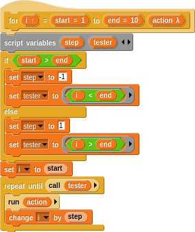
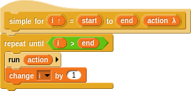
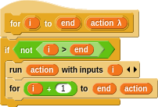
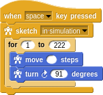

# Recursion

Take a look at this tiny sketch. It's rather amazing that just a few commands can result in such striking art.

The `for` loop runs the program within 222 times with `i` representing the iteration number. This is a common construct in many programming languages.

This is not the _only_ way to express iteration however. Some software developers are uneasy about the fact that `i` keeps changing _in place_. In mathematics this is like saying `x = x + 1` which makes no sense! There is no `x` for which this "equation" is true.

## The Functional Way

This _functional_ definition relies on recursion. In fact, recursion is the _only_ way to achieve loops in a pure functional sense. Notice that the definition of `squaril` refers to **itself** at the end! To read this, you think to yourself that `squirl` of `i` (as long as `i < 222`)  means to `move i steps` and `turn 91 degrees` followed by _another_ `squaril` of `i + 1`.

Another, more _inductive_ way to think of it is to say, "Assuming you know how to make a `squaril` of `i + 1`, then you know how to make a `squaril` of `i`. It's just blah, blah followed by _what you already know,_ and this is true for any `i < 222`." This kind of "deferred" thinking where you assume you know how to handle the recursive case and then can _inductively_ handle the current case is often a useful way to think about it.

In any case, unless you want **infinite** recursion, you always have a _base case_ that ends the process. In this case it's when `i >= 222`.

> Side note: If you've been taught that recursion is bad because you can "blow the stack" then you should take the time to learn about [tail call elimination](http://en.wikipedia.org/wiki/Tail_call) and fear not!

## How Do For Loops Work?

Do you remember when we said that being able to define new words that are indistinguishable from primitives is one of the primary means of abstraction? You probably think that the `for` loop is a primitive. Try right-clicking (or CTRL-click) and `Edit...` it.

There's a bit of a mess in there to handle reverse loops where the start is _greater_ than then end. If we strip that out, it's essentially:

The `change i by 1` is the "impure" part. It's the `x = x + 1`. Here's how to do it _functionally_:

This is a higher order word, [as we learned about earlier](hof.md), taking the `i` and `end` values and an `action` body. The base case is when `i` reaches `end`. The `action` is passed the current iteration (`i`) explicitly and this is incremented on each recursion. That's it!

How exactly do you pass an `action` taking a parameter? There's a _trick_ of sorts in the language in that simply leaving a slot empty yields a function taking a parameter.

Have fun sketching!
