# Roomba

Have you ever sat and watched the Roomba vacuum your house? It's amazing that it exhibits such "intelligent" behaviour when it's really mostly a so-called drunken walk. The roboticists at iRobot run simulations to optimize the behavior so that it _tends_ to cover the whole floor quickly when really it has very little idea where it is or where it's been. Take a look at an [iRobot Floor Coverage Lab Test](http://youtu.be/7FSUtSurqA4). Very interesting, isn't it?

> Side note: Dyson has [made a robot vacuum that _does_ do proper localization and navigation](https://www.dyson360eye.com/). I actually like the Roomba's simple, emergent behavior better. It has a certain elegance.

Let's see if we can do our own experiments. The real Roomba has several distinct behaviors:

* Random exploration
* Wall following
* Spiraling in open/dirty spaces

## Random Exploration

Let's start with random exploration.

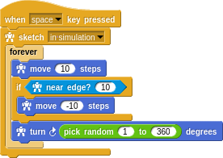
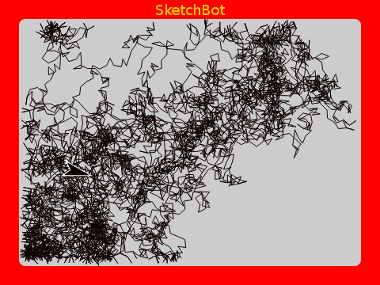

The poor little turtle wanders around the screen; moving and turning a random amount. It he's about to go off the screen he backs up.

This doesn't look like what the Roomba does though. That's how experimentation goes. Try things. See what they do. Try again...

The real Roomba seems to go in straight lines across the room and only randomly turn when bumping into things. Here we only have the edges of the screen to bump into (maybe later we'll draw some furnature!). The real robot has a "bump sensor" and a "cliff sensor". We just use the `near edge?` predicate.

Changing the program only slightly gives us something more like it.

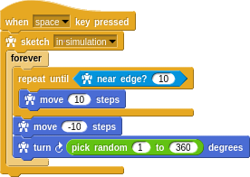
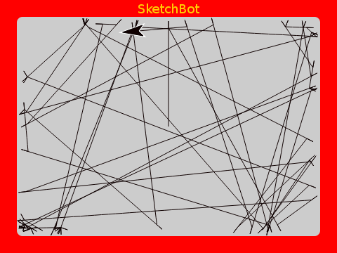

## Wall Following

The random exploration tends to cover the room (screen) pretty well, but it missed gaps along the edges. In a real home, the edges are where a lot of dirt accumulates. Watching the Roomba, you might have noticed that it hugs the walls and furnature edges and legs sometimes. Not always, but sometimes.

That's easy to do. Just turn a small amount every time we bump into the edge. The real Roomba has this same tiny bump-turn-bump-turn behavior as it's lining up with a wall edge:

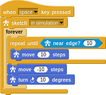
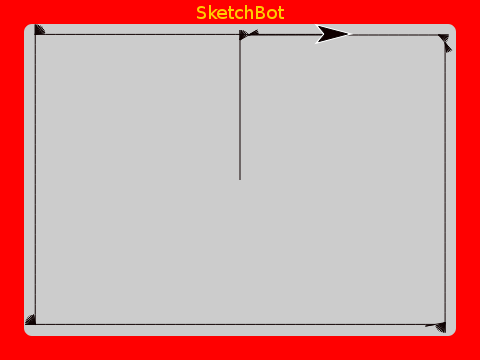

Very cool. Just a tiny change. We really want _both_ behaviors at once. How to choose which to do at any given time? With no other understanding of where we've been or what's been done already, that's a difficult question.

In keeping with the "embrace randomness" theme, how about we just randomly choose! First, let's make `follow wall` something that we can go do for some number of `steps`.

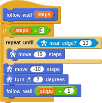

This way we can ask the turtle to carry out this behavior temporarily and then resume the _normal_ behavior of randomly exploring. Notice the use of recursion here, [which we learned earlier](recursion.md) here.

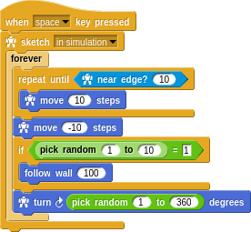
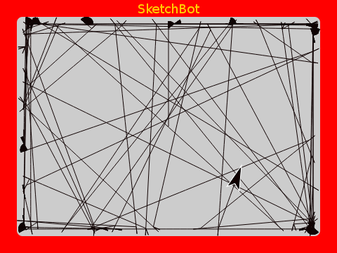

We're clearly getting decent floor coverage _and_ covering the edges completely.

## Spiraling

It seems a shame that when the robot first starts in the middle of wide open space, it inefficiently sets off bouncing around. The real Roomba does a spiraling manuver at first until it bumps into something. It also does this manouver, by the way, when it senses dirt on the floor (by **hearing** it kicked up by the beater bar with a microphone!).

You might think that simply scanning back and forth (the way you mow your lawn) would be best, but that turns out to be difficult in practice. The Roomba really can't rotate or translate itself very precisely and has no encoders or other sensors to give it feedback. With furnature and such it gets quite complicated.

Let's go ahead at add spiraling.

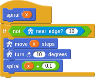
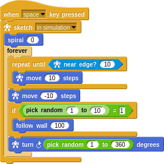
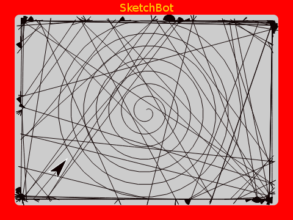

Not bad! We cover the wide open center of the room very well, catch the corners with random exploration, and get the edges thuroughly.

## Conclusion

This is the kind of process that roboticists at iRobot go through when optimizing the algorithms for most efficient and complete room coverage in their [lab video](http://youtu.be/7FSUtSurqA4) we watched at the beginning.

It's very interesting to see that emergent behavior often comes from very simple algorithms and that an effective vacuum robot can be built with very minimal sensors and with only very local understanding of it's environment. The [Dyson robot](https://www.dyson360eye.com/) may do a better job, but at a _much_ higher cost and complexity.
