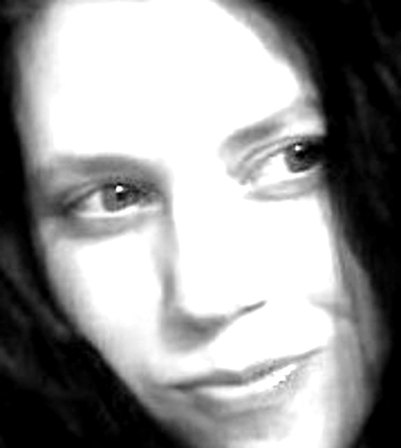
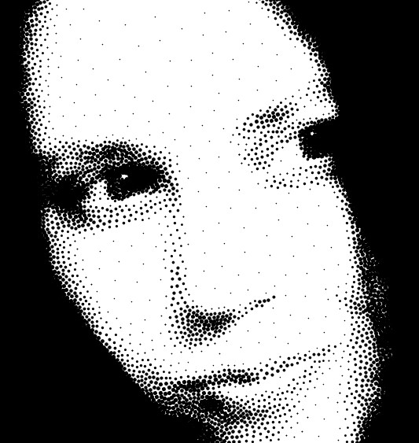
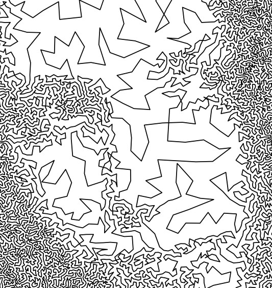

# Sketching Photographs

A very interesting approach to sketching photographs is to convert them to gray scale (preferably with high contrast):

Using weighted voronoi stippling, this is reduced to a set of rather _organically_ distributed points:

Finally a [Traveling Salesman]() solution is found; reducing this to a **single line** appropriate for a sketch!

This brilliant idea is from this paper: http://www.cgl.uwaterloo.ca/~csk/projects/tsp/

We've played with implementing this ourselves, and then discovered [StippleGen](https://code.google.com/p/eggbotcode/downloads/list?q=stipplegen); a wonderful implementation already out there.
